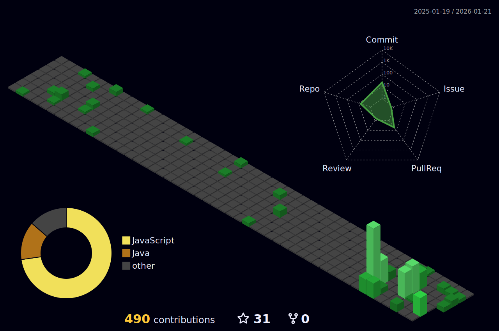

 
 

  <h1 align="left">👨🏽‍💻 | João Alcântara | Software Engineering</h1>
  
🌐 | Conect with me:

  
  

 
 
 
 

## About me, dive with me and get to know me a little more!

I turn your ideas and projects into highly scalable, high-performance web applications.

I'm 20 years old. I currently work as a junior front-end engineer and I have approximately 1 years of experience. I worked in several niches, such as education, launching digital products and web applications that demand high performance and scalability. I am passionate about developing dynamic and flexible interfaces, high performance pages with “pixel perfect” practice, code quality and clean code. I have experience in the web world, with modern technologies and good code practices acquired through BootCamp Discover, GoStack and Ignite from Coding School, [Rocketseat](https://github.com/Rocketseat).

 
 
 
 

 

## 📚 | My Technology Lab:

 

 
 
 

 
💼 | I'm looking for new job opportunities. <a href="https://www.linkedin.com/in/joaoalcantaradev/">📫 Contact-me</a>.

 
📚 | ReactJs and NextJs student for over a year.

 
📷 | I'm always sharing content, curiosities and new experiences on the <a href="https://dev.to/joaoalcdev">blog</a>.

 
☕ | Technology enthusiast, passionate about games, evolution and coffee!

 
 
 

 
 

## 📊 | My Github Stats:

 
💻 | Most used technologies;

 
🌐 | Contribution analysis;

 
⚙️ | Contribution management;

 
 
 
  

  

 
 
 

  
  

  
 |  |  |
 | ----------- | ----------- |

